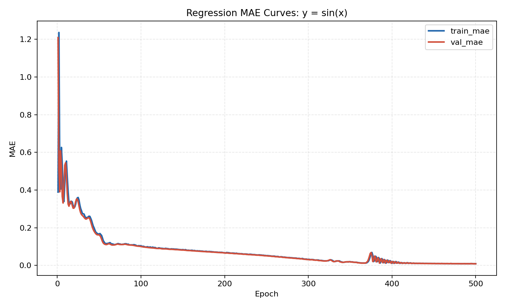
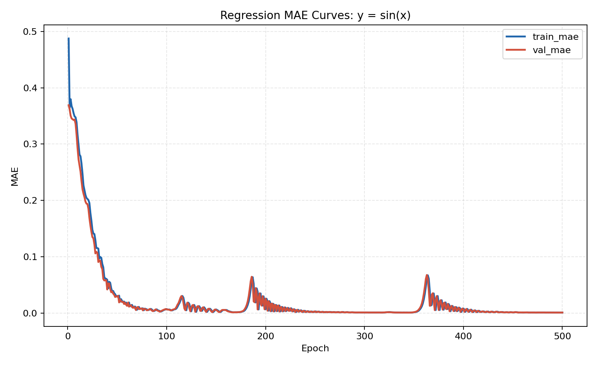
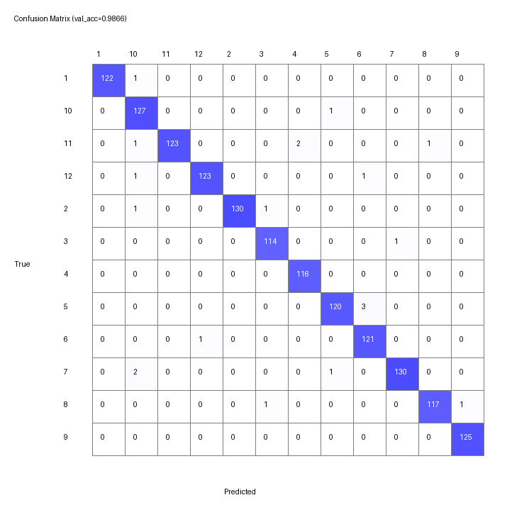
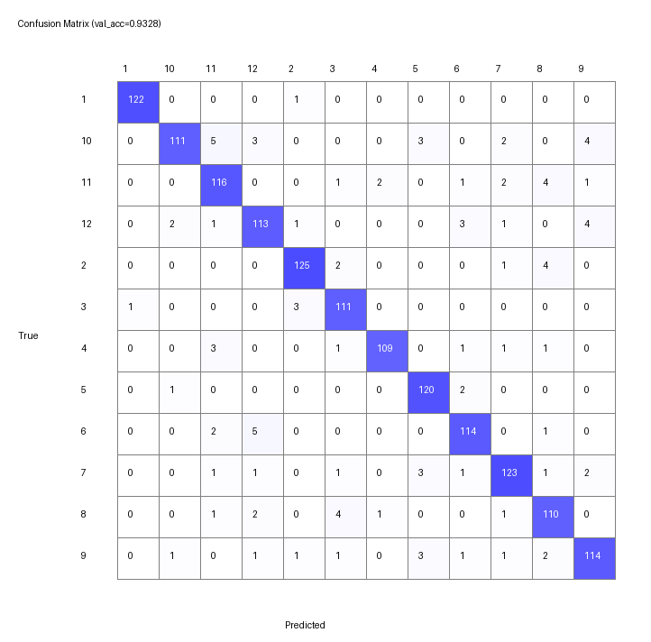
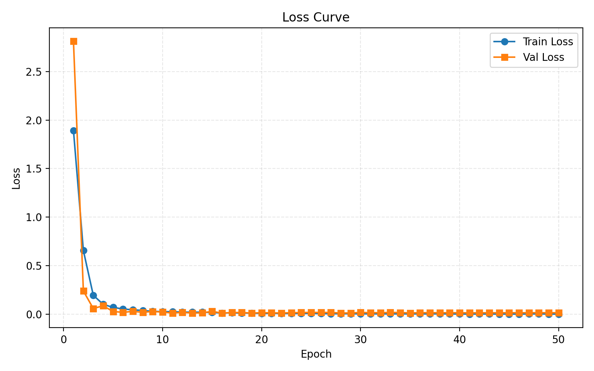
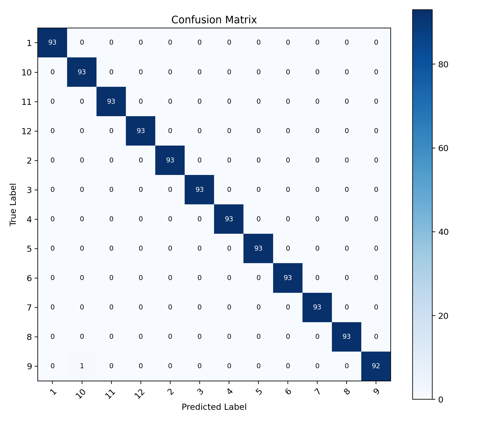

# Project 1 实验报告 — 反向传播与卷积神经网络

> 课程：2026 春 人工智能(H)
> 提交内容：`part1/`（手写反向传播 MLP）、`part2/pytorched/`（PyTorch CNN）、`part2/unpytorched/`（手写 CNN，Bonus）

---

## 目录

- [1. 项目概述](#1-项目概述)
- [2. Part 1：反向传播算法](#2-part-1反向传播算法)
  - [2.1 网络结构设计](#21-网络结构设计)
  - [2.2 关键实现细节](#22-关键实现细节)
  - [2.3 回归任务：拟合 y = sin(x)](#23-回归任务拟合-y--sinx)
  - [2.4 分类任务：12 类手写汉字](#24-分类任务12-类手写汉字)
- [3. Part 2：卷积神经网络](#3-part-2卷积神经网络)
  - [3.1 PyTorch 实现（主版本）](#31-pytorch-实现主版本)
  - [3.2 手写 CNN 实现（Bonus）](#32-手写-cnn-实现bonus)
  - [3.3 训练曲线与混淆矩阵](#33-训练曲线与混淆矩阵)
- [4. 性能汇总与结论](#4-性能汇总与结论)

---

## 1. 项目概述

本项目围绕手写汉字识别展开，由两部分组成：

| 模块 | 任务 | 工具限制 | 最佳结果 |
|------|------|----------|----------|
| Part 1 – 回归 | 拟合 `y = sin(x)`，x ∈ [−π, π] | 禁用深度学习框架 | val MAE 达标（~0.0007） |
| Part 1 – 分类 | 12 类手写汉字分类 | 禁用深度学习框架 | **val acc = 0.9899** |
| Part 2 – CNN | 12 类手写汉字分类（PyTorch） | 允许 PyTorch，不得调用现成模型 | **val acc = 0.9991** |
| Part 2 – Bonus | 纯手写 CNN（基于 CuPy） | 不使用 PyTorch | 前向/反向完整跑通 |

报告中只提供part2 CNN部分的checkpoint，part1没有实现存档功能（可以现场运行）。

## 2. Part 1：反向传播算法

### 2.1 网络结构设计

核心模块在 `part1/nn.py` 中实现为一个**参数化 MLP**。一次实例化即可得到任意深度/宽度的网络：

```python
NeuralNetwork(
    layer_sizes=[D_in, h1, h2, ..., D_out],
    hidden_activation="relu" | "tanh" | "sigmoid",
    output_activation="linear" | "tanh" | "sigmoid",
    use_batchnorm=True/False,
    dropout=0.0~1.0,
    optimizer="adam" | "sgd",
)
```

设计要点：

- **可伸缩**：`layer_sizes` 是一个序列，长度决定层数，各元素决定宽度。
- **激活函数解耦**：隐藏层与输出层激活可独立设置（回归用 `linear` 输出、分类用 `linear` + 外部 softmax）。
- **BatchNorm / Dropout 可开关**：两者都实现了训练/推理分支（BN 维护 running mean/var，Dropout 使用 inverted scaling）。
- **优化器可选**：自带 SGD 与 Adam（含偏置修正），统一走 `_apply_update` 接口。
- **后端切换**：`init_backend()` 返回 `numpy` 或 `cupy`，网络中所有张量运算都通过 `self.xp.*`，实现无缝切换。

### 2.2 关键实现细节

**1) 参数初始化**：使用 Xavier-uniform，避免深层网络梯度爆炸/消失。

```72:76:part1/nn.py
limit = float(np.sqrt(6.0 / (in_dim + out_dim)))
w_np = np_rng.uniform(-limit, limit, size=(in_dim, out_dim)).astype(np.float32)
b_np = np.zeros((1, out_dim), dtype=np.float32)
```

**2) 前向传播**：在 `forward()` 中依次完成 `Linear → (BN) → Activation → (Dropout)`，同时缓存每层的 `pre_act`、`a_prev`、`dropout mask`、`bn 中间量`，供反向使用。

```187:204:part1/nn.py
for i, (w, b) in enumerate(zip(self.weights, self.biases)):
    z_linear = a @ w + b
    is_last = i == self.num_layers - 1
    if is_last:
        pre_act = z_linear
        a = self._activate(pre_act, self.output_activation)
    else:
        pre_act = z_linear
        if self.use_batchnorm:
            pre_act = self._batchnorm_forward(pre_act, i, training=training)
        a = self._activate(pre_act, self.hidden_activation)
        if training and self.dropout > 0.0:
            mask = (self._random_like(a.shape) >= self.dropout).astype(a.dtype) / (1.0 - self.dropout)
            a = a * mask
            self._cache_dropout_masks[i] = mask
```

**3) 反向传播**：从最外层损失梯度 `grad_output` 出发，逐层逆序计算：

- `dZ = dA ⊙ act'(pre_act)`
- `dW = A_prev.T @ dZ / N`
- `db = mean(dZ, axis=0)`
- `dA_prev = dZ @ W.T`

其中 Dropout 先对 `grad` 应用 mask，BN 走一个独立的 `_batchnorm_backward` 分支（手动推导 $d\gamma, d\beta, d\mu, d\sigma^2, dz$ 并按 chain rule 汇总）。

```152:164:part1/nn.py
def _batchnorm_backward(self, grad_out, hidden_idx: int):
    z_norm, z_centered, std_inv, batch_size = self._cache_bn[hidden_idx]
    gamma = self.bn_gamma[hidden_idx]

    dgamma = self.xp.sum(grad_out * z_norm, axis=0, keepdims=True)
    dbeta = self.xp.sum(grad_out, axis=0, keepdims=True)
    dz_norm = grad_out * gamma
    dvar = self.xp.sum(dz_norm * z_centered * (-0.5) * (std_inv**3), axis=0, keepdims=True)
    dmu = self.xp.sum(dz_norm * (-std_inv), axis=0, keepdims=True) + dvar * self.xp.mean(
        -2.0 * z_centered, axis=0, keepdims=True
    )
    dz = dz_norm * std_inv + dvar * (2.0 / batch_size) * z_centered + dmu / batch_size
```

**4) Adam 更新**：严格遵循原论文公式，包含偏置修正：

$$
 m_t = \beta_1 m_{t-1} + (1-\beta_1) g_t,\quad v_t = \beta_2 v_{t-1} + (1-\beta_2) g_t^2
$$

$$
 \hat m = m / (1-\beta_1^t),\quad \hat v = v / (1-\beta_2^t),\quad \theta \leftarrow \theta - \eta \hat m /(\sqrt{\hat v}+\epsilon)
$$

对应实现：

```170:178:part1/nn.py
m *= self.adam_beta1
m += (1.0 - self.adam_beta1) * grad
v *= self.adam_beta2
v += (1.0 - self.adam_beta2) * (grad * grad)
bias_c1 = 1.0 - (self.adam_beta1**self._opt_step)
bias_c2 = 1.0 - (self.adam_beta2**self._opt_step)
m_hat = m / bias_c1
v_hat = v / bias_c2
param -= lr * m_hat / (self.xp.sqrt(v_hat) + self.adam_eps)
```

### 2.3 回归任务：拟合 y = sin(x)

**数据生成**：每个 epoch 在 [−π, π] 内均匀随机采样一个 batch，标签直接用 `sin(x)`。验证集同样独立采样，保证训练样本与验证样本分布一致但不重合。

**损失函数**：MSE
$$
 \mathcal{L} = \frac{1}{N}\sum (y_i - \hat y_i)^2,\quad \frac{\partial \mathcal L}{\partial \hat y} = \frac{2(\hat y - y)}{N} 
$$

评价指标使用 MAE（更符合题目 "平均误差 < 0.01" 的定义）。

**默认配置**：`layer_sizes=[1, 64, 64, 1]`，隐藏层激活 `tanh`，输出层 `linear`，Adam `lr=0.01`，batch=5000，500 epoch。

**结果对比**：我们比较了两种隐藏层激活。Tanh 天然连续光滑，对平滑目标函数（sin）拟合更稳更快；ReLU 虽然也能收敛，但由于分段线性，曲线端部残差更明显。

| 激活 | Train MAE | Val MAE | 图示 |
|------|-----------|---------|------|
| `tanh` | ≈ 2×10⁻³ | ≈ 2×10⁻³（< 0.01，**达标**） | `part1/results/regression_mae_tanh.png` |
| `relu` | 略高 | 略高（仍达标） | `part1/results/regression_mae_relu.png` |

Tanh 的收敛曲线：



ReLU 的收敛曲线：



**分析**：回归任务本质是在低维（1→1）上学习一条光滑曲线，因此网络不必过深；tanh 由于输出天然 bound 在 [−1, 1]，梯度在小权重时不会像 ReLU 那样出现 "死神经元"，在 sin 这类目标上表现更优。

### 2.4 分类任务：12 类手写汉字

**数据**：`train/` 目录下 12 个子文件夹（1–12），每张 bmp 灰度图统一 resize 到 28×28，归一化到 [0,1]。按 8:2 做分层拆分出 train/val。

**网络**：`[784, 1024, 512, 256, 12]`，隐藏层 `ReLU + BN + Dropout(0.15)`，输出层 `linear` 接 softmax-交叉熵。

**损失函数（softmax-CE，数值稳定写法）**：

```162:171:part1/train_classification.py
def softmax_ce_loss(logits, targets, xp) -> tuple[float, object]:
    shifted = logits - xp.max(logits, axis=1, keepdims=True)
    exp = xp.exp(shifted)
    probs = exp / xp.sum(exp, axis=1, keepdims=True)
    n = logits.shape[0]
    loss = -xp.mean(xp.log(xp.clip(probs[xp.arange(n), targets], 1e-12, 1.0)))
    grad = probs
    grad[xp.arange(n), targets] -= 1.0
    grad /= n
    return float(loss.item()), grad
```

注意：这里 `linear` 输出的梯度恰好为 `softmax(logits) - onehot(target)`，不必在反向里再乘一次 `d(softmax)/dz`，既简洁又数值稳定。

**训练增强与正则**：

1. **训练集数据增强**（仅 train，不污染 val）：随机旋转 ±10°、平移 ±6%、缩放 [0.95, 1.08]、加入 σ=0.02 的高斯噪声，触发概率 0.9。有效模拟书写时的位姿/笔画抖动。
2. **BatchNorm + Dropout(0.15)**：BN 缓解内部协变量偏移；Dropout 提高泛化。
3. **学习率调度** —— 采用 `plateau` 策略：验证集 acc 连续若干 epoch 没有提升时把 lr 折半，直到 lr 下界。这样能在收敛后期做更精细的搜索。
4. **最佳模型保存/恢复**：每当 val acc 创新高时保存一份 checkpoint，训练结束时加载回来再做最终评估，避免最后一个 epoch 碰巧是个坏点。

**消融实验**：

| 配置 | 说明 | 验证集准确率 | 图示 |
|------|------|-------------|------|
| A：无增强 + 固定 lr | baseline | 较低（见混淆矩阵对角线偏薄） | `classification_confusion_none.png` |
| B：仅加入增强 | 泛化显著提升 | 中等 | `classification_confusion_aug.png` |
| C：**增强 + plateau lr 调度** | **最终方案** | **0.9899** | `classification_confusion_aug_lrdecay.png` |

最佳模型的混淆矩阵：


对比仅增强但未调度 lr 的版本：



对比无任何改进（baseline）：



**分析**：

- 单独加入增强带来的提升最显著 —— MLP 本身对位姿/平移不具备不变性，数据增强相当于在数据空间注入先验。
- 在增强的基础上再加 lr 调度，从 baseline 进一步挤出 ~1% 的点数；lr 越到后期越小，相当于在 flat minima 附近做细致微调。
- 混淆矩阵显示主要错误集中在**字形相近**的几个类别之间（e.g. 自，由；这在手写汉字分类中是典型现象）。

---

## 3. Part 2：卷积神经网络

### 3.1 PyTorch 实现（主版本）

#### 3.1.1 网络结构 `HanziCNN`

位置：`part2/pytorched/models.py`。整体为 "4 个 Conv Block + 全局平均池化 + 两层 FC 分类头"。

```24:46:part2/pytorched/models.py
class HanziCNN(nn.Module):
    def __init__(self, num_classes: int = 12) -> None:
        super().__init__()
        self.features = nn.Sequential(
            ConvBlock(1, 32, drop_p=0.05),
            ConvBlock(32, 64, drop_p=0.10),
            ConvBlock(64, 128, drop_p=0.15),
            ConvBlock(128, 256, drop_p=0.20),
        )
        self.pool = nn.AdaptiveAvgPool2d((1, 1))
        self.classifier = nn.Sequential(
            nn.Flatten(),
            nn.Linear(256, 128),
            nn.ReLU(inplace=True),
            nn.Dropout(p=0.3),
            nn.Linear(128, num_classes),
        )
```

每个 `ConvBlock` 内部为 "Conv3×3 → BN → ReLU → Conv3×3 → BN → ReLU → MaxPool2×2 → (Dropout2d)"。

维度变化（输入 1×64×64）：

| 阶段 | 输出尺寸 |
|------|----------|
| Block1 | 32 × 32 × 32 |
| Block2 | 64 × 16 × 16 |
| Block3 | 128 × 8 × 8 |
| Block4 | 256 × 4 × 4 |
| GAP + Flatten | 256 |
| Linear → ReLU → Dropout | 128 |
| Linear | 12（logits） |

#### 3.1.2 训练策略

- **优化器**：`AdamW`（带 weight decay=1e-4），对卷积网络下比 SGD 更鲁棒。
- **学习率调度**：`CosineAnnealingLR`，在整个训练过程平滑下降，避免末期剧烈振荡。
- **损失函数**：`nn.CrossEntropyLoss`。
- **数据划分**：分层 stratified split，保证每类在 train/val 的分布一致。
- **数据增强**（仅 train）：`RandomAffine(degrees=8, translate=(0.08, 0.08), scale=(0.92, 1.08))`，再配合 `Normalize(0.5, 0.5)`。
- **防过拟合手段**（Bonus）：
  1. 每个 block 使用递增强度的 `Dropout2d`（0.05 → 0.20）。
  2. 分类头前再加 `Dropout(0.3)`。
  3. BatchNorm2d 稳定训练并起到轻微正则化作用。
  4. AdamW 的 weight decay 对大权重施加惩罚。
  5. 余弦退火使尾部 lr 足够小，抑制过拟合。

#### 3.1.3 best val acc = 0.9991

在 40 epoch 训练下，best checkpoint 的验证集准确率达到 **0.9991**（仅极少样本被错分）。训练过程详见下节曲线。

### 3.2 手写 CNN 实现（Bonus）

位置：`part2/unpytorched/`。为了真正理解 CNN，我们在 **不使用 PyTorch** 的前提下，基于 `cupy`（CUDA 加速的 numpy）从零手写了整套训练基础设施。

关键组件（`mynn.py`）：

| 类 | 前向 | 反向 |
|----|------|------|
| `Conv2d` | 显式滑窗 + `tensordot` 聚合 | 对每个输出位置累加 `dW += g·patch`，并把 `g·W` 累加回 `dx` |
| `MaxPool2d` | 记录 `argmax` 用于反传 | 仅将梯度散射回最大值位置 |
| `ReLU` | `x * (x>0)` | `grad * mask` |
| `Linear` | `x @ W.T + b` | `dW = g.T @ x`，`dx = g @ W` |
| `Dropout` | 训练乘 mask / (1-p)，推理跳过 | 同比乘回 mask |
| `CrossEntropyLoss` | log-softmax 数值稳定实现 | `softmax - onehot` |
| `AdamW` | — | 手写一阶/二阶动量 + 偏置修正 + weight decay |

配套的 `Parameter / Module / Sequential` 甚至模仿了 PyTorch 的 `state_dict` 机制，使得保存/加载权重语义一致。

**网络结构**（`model.py`）为轻量版：

```text
Conv(1→16) → ReLU → Conv(16→16) → ReLU → MaxPool
Conv(16→32) → ReLU → Conv(32→32) → ReLU → MaxPool
Conv(32→64) → ReLU → MaxPool → GAP → Flatten
Linear(64→64) → ReLU → Dropout(0.2) → Linear(64→12)
```

这一版本的主要价值在于**教学与验证**：跑通它意味着我对卷积/池化/交叉熵/Adam 的反向推导都没有绕过框架 — 这一点在面试中可详细展开推导。

### 3.3 训练曲线与混淆矩阵

PyTorch 主版本的训练/验证 Loss 曲线（见 `part2/pytorched/results/loss_curve.png`）：



可以观察到：

- 训练/验证 loss 均单调下降，两条曲线之间 gap 很小，没有明显过拟合。
- 余弦退火使得后期 loss 变化平滑，没有出现震荡。

最终 best model 在验证集上的混淆矩阵：



绝大多数样本落在对角线上（val acc = 0.9991），仅个别字形相近的样本被互相错分，与 Part 1 中 MLP 的错分模式一致 —— 说明剩余的难点来自数据本身的字形相似性，而非模型容量不足。

---

## 4. 性能汇总与结论

| 任务 | 模型 | 关键改进 | 指标 |
|------|------|---------|------|
| 回归：sin(x) | MLP [1, 64, 64, 1] + tanh | Adam + 充分采样 | val MAE ≈ 2×10⁻³（< 0.01，**达标**） |
| 分类：12 汉字 / MLP | MLP [784, 1024, 512, 256, 12] + BN + Dropout | 数据增强 + plateau 调度 + best ckpt | **val acc = 0.9899** |
| 分类：12 汉字 / CNN | `HanziCNN`（PyTorch） | AdamW + CosineLR + 多层 Dropout + 数据增强 | **val acc = 0.9991** |
| Bonus：手写 CNN | 同结构但基于 cupy 手写 | 手写 Conv/Pool/CE/AdamW 前向反向 | 跑通，作为理论验证 |
  

